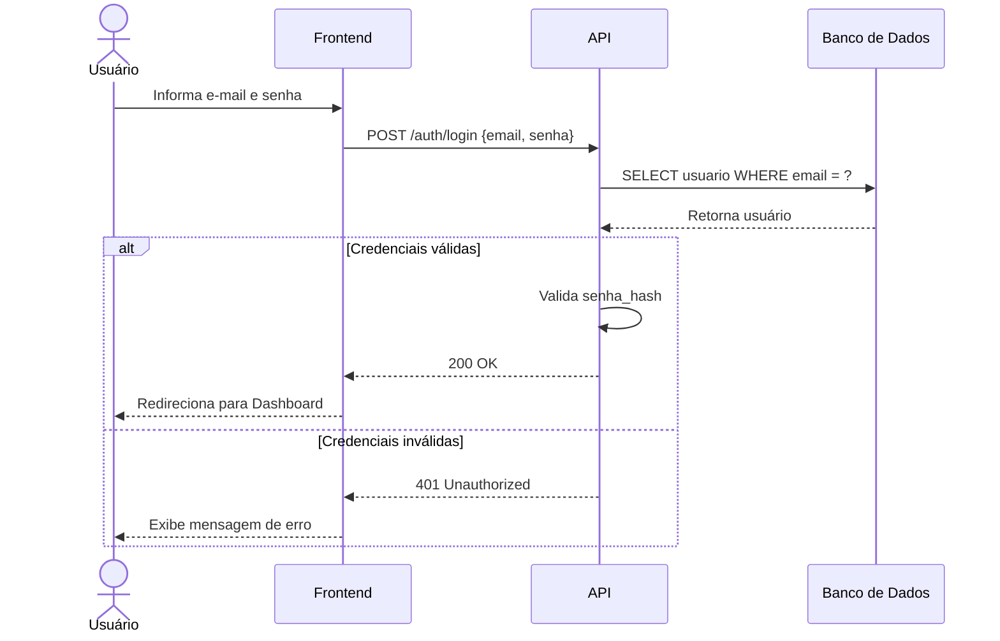
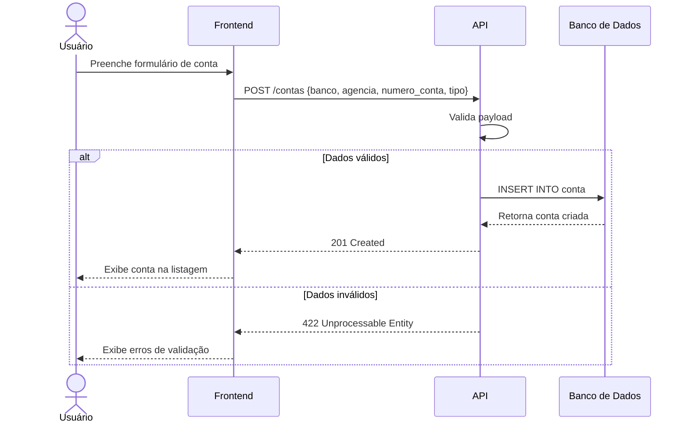
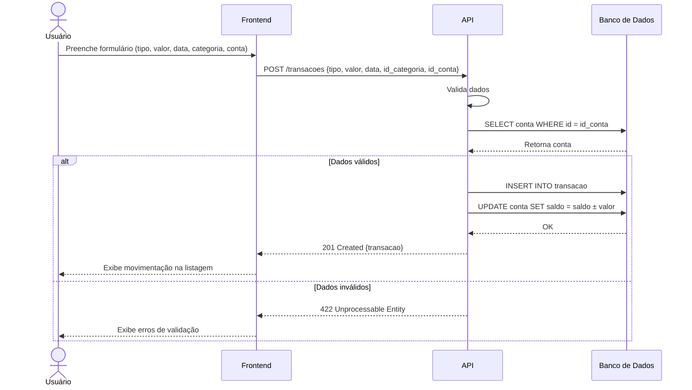
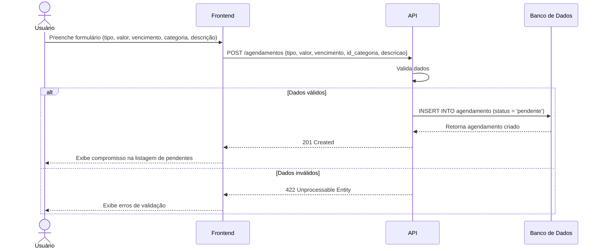
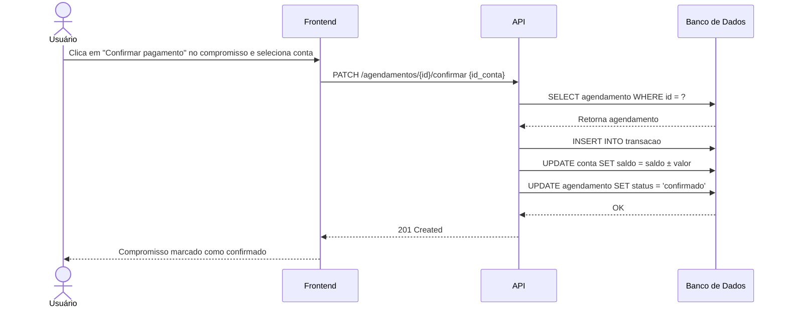
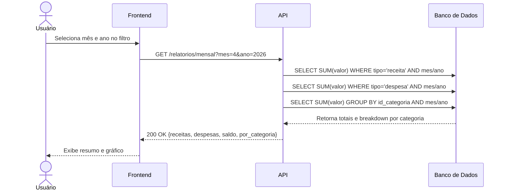

# Diagrama de Sequência — Sistema de Gestão Financeira

## 1. Login

---

## 2. Cadastro de Conta

---

## 3. Cadastro de Movimentação

---

## 4. Cadastro de Compromisso

---

## 5. Confirma Pagamento do Compromisso

---

## 6. Relatório Mensal

